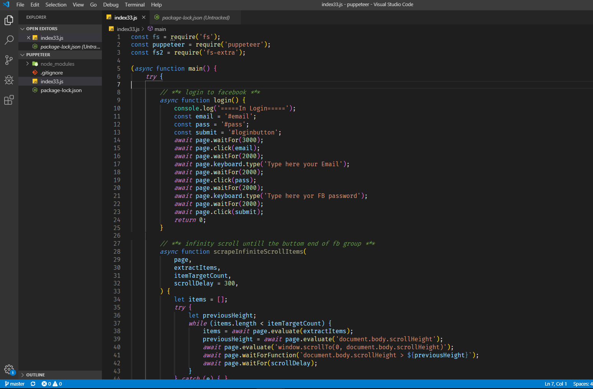

# Puppeteer-FB-page-scraper

Hello cool people of Github :)

This is a FB page scraper, based on the JS library - PUPPETEER.
The main goal here is to scrpae all exposed E-mails of memebers of a specific group and then write it to a csv file.

please note that you must do 4 things:
1. npm i puppeteer
2. npm i fs-extra
3. Type your own FB username account and password ( You will see it in the code )
4. Type the URL of your required FB Page you wish to scrape ( You will see it in the code ) :)

Pay attention!!!! 
There is a chance that FB will "BLOCK" your account if it identify that you scrape alot...

Good Luck!!!
